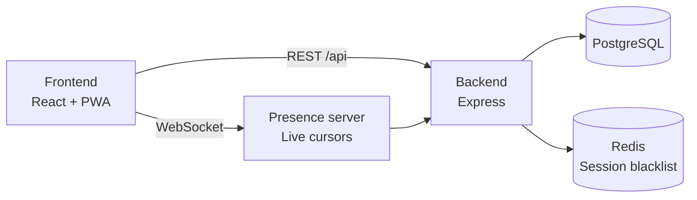

# 🏒 OpenFloorball

*[🇩🇪 Deutsch](README.md) | 🇬🇧 English*

**Self-hosted tactics board and coaching platform for floorball**

[](https://github.com/freddykrueger88/OpenFloorball/actions/workflows/ci.yml)
[](https://github.com/freddykrueger88/OpenFloorball/blob/main/LICENSE)
[](https://hub.docker.com/)
[](https://github.com/freddykrueger88/OpenFloorball/issues)

> **Version:** 0.9.0 · **Status:** Active development, in production
> use · **Stack:** React/Vite · Node/Express · PostgreSQL · Redis ·
> Docker

Detailed, continuously updated status (German, see note below):
**[docs/current-status.md](docs/current-status.md)**

---

## 📋 Table of contents

- [What is OpenFloorball?](#-what-is-openfloorball)
- [Screenshots](#-screenshots)
- [Current status](#-current-status)
- [Features](#-features)
- [Roadmap](#-roadmap)
- [Installation](#-installation)
- [Development](#-development)
- [Architecture](#-architecture)
- [Project structure](#-project-structure)
- [Documentation](#-documentation)
- [Contributing](#-contributing)
- [License](#-license)

---

## 🤔 What is OpenFloorball?

OpenFloorball is a digital tactics board for floorball coaches: field,
players, and plays can be placed on screen, drawn, played back as an
animation, and shared as GIF/MP4/PDF/link. Beyond that, the platform
covers the rest of the coaching workflow – training planning, roster
management, team/club structure, an exercise library for sharing with
other clubs, and optional AI assistance for training planning, tactic
variants, and analysis.

The platform is self-hosted (Docker Compose), not a vendor's cloud
service – your data stays on your own infrastructure.

## 📸 Screenshots

<table>
<tr>
<td width="50%"></td>
<td width="50%"></td>
</tr>
</table>

More views (training planner, roster, community library, mobile use):
**[docs/wiki/Screenshots.md](docs/wiki/Screenshots.md)** (German wiki,
screenshots speak for themselves)

## 📊 Current status

The core (tactics board, animation, export) is stable and in use.
Around that core, a training planner, team/club management, community
library, four AI assistants, video integration, real-time presence
(live cursors), a password reset flow, and a two-part onboarding tour
(navigation + board editor) are already implemented. Offline conflict
detection doesn't yet cover every resource. Details, limitations, and
known issues (German): **[docs/current-status.md](docs/current-status.md)**.

## ✨ Features

| Area | Status | Details |
|---|---|---|
| Tactics board (field, drawing, frame animation, versioning) | ✅ | [Spielzuege-Zeichnen.md](docs/wiki/Spielzuege-Zeichnen.md), [Animation.md](docs/wiki/Animation.md) |
| Formation templates, playbooks | ✅ | [Formationen.md](docs/wiki/Formationen.md), [Playbooks.md](docs/wiki/Playbooks.md) |
| Training planner, roster, lines | ✅ | [Trainingsplaner.md](docs/wiki/Trainingsplaner.md), [Kader.md](docs/wiki/Kader.md), [Lines.md](docs/wiki/Lines.md) |
| Live game notes | ✅ | [Live-Spielnotizen.md](docs/wiki/Live-Spielnotizen.md) |
| Teams and clubs | ✅ | [Teams-und-Vereine.md](docs/wiki/Teams-und-Vereine.md) |
| Board sharing (collaborators, invites, links) | ✅ | [Export.md](docs/wiki/Export.md) |
| Community exercise library | ✅ | [Community-Bibliothek.md](docs/wiki/Community-Bibliothek.md) |
| AI assistants (training/tactics/analysis/knowledge, optional) | ✅ | [KI-Assistenten.md](docs/wiki/KI-Assistenten.md) |
| Video integration (upload, drawing overlay, trimming, markers, video→board) | ✅ | [Video-Integration.md](docs/wiki/Video-Integration.md) |
| Real-time presence (live cursors) | ✅ | [Echtzeit-Zusammenarbeit.md](docs/wiki/Echtzeit-Zusammenarbeit.md) |
| Export as GIF/MP4/PDF | ✅ | [Export.md](docs/wiki/Export.md) |
| PWA / offline mode | 🟡 | Conflict detection only for boards/frames/trainings/roster, see [Offline-Modus.md](docs/wiki/Offline-Modus.md) |
| Onboarding tour | ✅ | On first login, skippable |
| In-depth editor tour | ✅ | In the board editor, independent of the onboarding tour, re-openable via the help icon |
| GDPR (export, deletion, backup) | ✅ | [Datenschutz.md](docs/wiki/Datenschutz.md), [Backup.md](docs/wiki/Backup.md) |
| Accessibility | ✅ | Colorblind filters, screen reader, keyboard, font sizes |
| Password reset | ✅ | Via email link, requires configured SMTP delivery |
| Language | ✅ | German (default) and English in the UI, more languages in progress – see [Contributing a translation](#-contributing) |

## 🗺️ Roadmap

**Done** (excerpt, full history in [CHANGELOG](CHANGELOG.md)):
Tactics board core, training planner, roster-based lines, live game
notes, teams/clubs, community library, AI assistants, video
integration (incl. video → tactics board), real-time presence,
onboarding tour, in-depth editor tour, extended offline conflict
resolution, password reset flow, manual backup trigger, German/English
UI localization.

**In progress:** no feature currently in a visibly unfinished state –
see [docs/current-status.md](docs/current-status.md) (German) for the
continuously updated status.

**Planned** (excerpt from [docs/planning/BACKLOG.md](docs/planning/BACKLOG.md)):
- Native app store presence (PWA wrapper)
- Vite 8 / ESLint 10 upgrade (currently blocked by peer-dependency conflicts)
- More UI languages, prioritized by actual floorball activity (Swedish, Finnish, Czech, Slovak first) – see [ISSUE 027](docs/planning/BACKLOG.md)

## 🚀 Installation

### Requirements

- Docker and Docker Compose
- A server or local machine to host it on

### Quick start with Docker

```bash
git clone https://github.com/freddykrueger88/OpenFloorball.git
cd OpenFloorball
cp .env.example .env
```

**Edit `.env` before starting** – at minimum `DB_PASSWORD`,
`REDIS_PASSWORD`, and `JWT_SECRET` must be set, otherwise Docker
Compose refuses to start (deliberately hard-required fields, no
insecure defaults). All variables are documented in
[docs/wiki/Umgebungsvariablen.md](docs/wiki/Umgebungsvariablen.md)
(German).

```bash
docker compose up -d
```

Starts four containers: `frontend` (Nginx, the only host port),
`backend` (Node/Express), `db` (PostgreSQL), and `redis` – backend,
DB, and Redis are only reachable inside the Docker network.

Then open in your browser: `http://localhost:${APP_PORT:-3000}`

### Optional: TLS/HTTPS for production use

```bash
DOMAIN=your-domain.com docker compose -f docker-compose.yml -f docker-compose.tls.yml up -d
```

Details: [docs/wiki/Installation-Docker.md](docs/wiki/Installation-Docker.md) (German)

## 👨‍💻 Development

No local Node.js needed – backend and frontend each run in their own
containers; lint/test/build also run containerized (see
[docs/wiki/Installation-Entwicklung.md](docs/wiki/Installation-Entwicklung.md)
(German) for the full workflow including live reload).

```bash
# Backend: lint & tests
docker run --rm -v $(pwd)/backend:/app -w /app node:24-alpine \
  sh -c "npm install && npm run lint && npm test"

# Frontend: lint, tests & build
docker run --rm -v $(pwd)/frontend:/app -w /app node:24-alpine \
  sh -c "npm install && npm run lint && npm test && npm run build"

# After code changes: rebuild and restart the affected service
docker compose build backend   # or: frontend
docker compose up -d backend
```

The same lint/test steps also run in CI (GitHub Actions, see badge
above).

## 🏛️ Architecture



Details incl. data model, export data flow, and AI provider
integration: [docs/wiki/Architektur.md](docs/wiki/Architektur.md) (German)

## 📁 Project structure

```text
OpenFloorball/
├── backend/     # Node/Express API, PostgreSQL migrations, tests
├── frontend/    # React/Vite PWA
├── docs/
│   ├── planning/   # Vision, architecture decisions, backlog
│   └── wiki/       # User and developer documentation
├── scripts/     # Standalone helper scripts (e.g. test AI server)
├── docker-compose.yml
└── docker-compose.tls.yml   # optional TLS overlay (Caddy)
```

Full, current structure with rationale:
[docs/planning/REPOSITORY_STRUCTURE.md](docs/planning/REPOSITORY_STRUCTURE.md) (German)

## 📚 Documentation

> **Note:** the in-depth project wiki (`docs/wiki/`) and planning docs
> (`docs/planning/`) are currently German-only. The application UI
> itself is fully bilingual (German/English, more languages in
> progress) – translating the documentation is a separate, larger
> effort that hasn't happened yet. Contributions welcome, see
> [Contributing](#-contributing).

- **[docs/wiki/Home.md](docs/wiki/Home.md)** – full wiki (installation,
  every feature in detail, API reference, architecture) – German
- **[docs/current-status.md](docs/current-status.md)** – detailed
  current status, known issues, next steps – German
- **[CHANGELOG.md](CHANGELOG.md)** – full version history – German

## 🤝 Contributing

Contributions are welcome – read [CONTRIBUTING.md](CONTRIBUTING.md)
first (German). Code of conduct: [CODE_OF_CONDUCT.md](CODE_OF_CONDUCT.md).
Please report security vulnerabilities per [SECURITY.md](SECURITY.md),
not as a public issue.

Want to help translate the app into your language? Start here:
**[docs/TRANSLATING.en.md](docs/TRANSLATING.en.md)** – no external
translation tool needed, just a text editor and one test command.

## 📄 License

MIT License – see [LICENSE](LICENSE).

---

<p align="center">
  <em>OpenFloorball – because tactics is more than just chalk on the board.</em>
</p>
