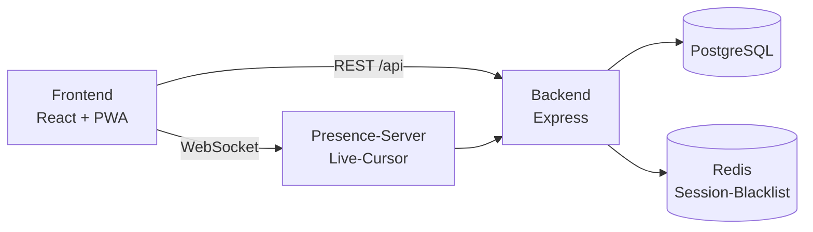

# 🏒 OpenFloorball

*🇩🇪 Deutsch | [🇬🇧 English](README.en.md)*

**Selbst gehostetes Taktikboard und Coaching-Plattform für Floorball**

[](https://github.com/freddykrueger88/OpenFloorball/actions/workflows/ci.yml)
[](https://github.com/freddykrueger88/OpenFloorball/blob/main/LICENSE)
[](https://hub.docker.com/)
[](https://github.com/freddykrueger88/OpenFloorball/issues)
[](https://github.com/freddykrueger88/OpenFloorball/stargazers)
[](https://github.com/sponsors/freddykrueger88)
[](https://opencollective.com/freddykrueger)

> **Version:** 0.9.0 · **Status:** Aktive Entwicklung, produktiv im
> Einsatz · **Stack:** React/Vite · Node/Express · PostgreSQL · Redis
> · Docker

Ausführlicher, laufend aktualisierter Stand:
**[docs/current-status.md](docs/current-status.md)**

---

## 📋 Inhaltsverzeichnis

- [Was ist OpenFloorball?](#-was-ist-openfloorball)
- [Screenshots](#-screenshots)
- [Aktueller Stand](#-aktueller-stand)
- [Features](#-features)
- [Roadmap](#-roadmap)
- [Installation](#-installation)
- [Entwicklung](#-entwicklung)
- [Architektur](#-architektur)
- [Projektstruktur](#-projektstruktur)
- [Dokumentation](#-dokumentation)
- [Mitwirken](#-mitwirken)
- [Lizenz](#-lizenz)

---

## 🤔 Was ist OpenFloorball?

OpenFloorball ist ein digitales Taktikboard für Floorball-Trainer:
Spielfeld, Spieler und Spielzüge lassen sich am Bildschirm platzieren,
zeichnen, als Animation abspielen und als GIF/MP4/PDF/Link teilen.
Darüber hinaus deckt die Plattform den weiteren Trainingsalltag ab –
Trainingsplanung, Kaderverwaltung, Team-/Vereinsstruktur, eine
Übungsbibliothek zum Teilen mit anderen Vereinen sowie optionale
KI-Unterstützung bei Trainingsplanung, Taktikvarianten und Analyse.

Die Plattform wird selbst gehostet (Docker Compose), nicht als
Cloud-Dienst eines Anbieters – die Daten bleiben auf der eigenen
Infrastruktur.

## 📸 Screenshots

<table>
<tr>
<td width="50%"></td>
<td width="50%"></td>
</tr>
</table>

Weitere Ansichten (Trainingsplaner, Kader, Community-Bibliothek,
mobile Nutzung): **[docs/wiki/Screenshots.md](docs/wiki/Screenshots.md)**

## ⭐ Star-Historie

<a href="https://star-history.com/#freddykrueger88/OpenFloorball&Date">
  <picture>
    <source media="(prefers-color-scheme: dark)" srcset="https://api.star-history.com/svg?repos=freddykrueger88/OpenFloorball&type=Date&theme=dark" />
    <source media="(prefers-color-scheme: light)" srcset="https://api.star-history.com/svg?repos=freddykrueger88/OpenFloorball&type=Date" />
    
  </picture>
</a>

## 📊 Aktueller Stand

Der Kern (Taktikboard, Animation, Export) ist stabil im Einsatz.
Rund um den Kern sind bereits Trainingsplaner, Team-/Vereinsverwaltung,
Community-Bibliothek, vier KI-Assistenten, Video-Integration,
Echtzeit-Präsenz (Live-Cursor), ein Passwort-Reset-Flow sowie eine
zweistufige Einführungstour (Navigation + Board-Editor) implementiert.
Die Offline-Konflikterkennung deckt bisher nicht alle Ressourcen ab.
Details, Einschränkungen und bekannte Probleme:
**[docs/current-status.md](docs/current-status.md)**.

## ✨ Features

| Bereich | Status | Details |
|---|---|---|
| Taktikboard (Spielfeld, Zeichnen, Frame-Animation, Versionierung) | ✅ | [Spielzüge zeichnen](docs/wiki/Spielzuege-Zeichnen.md), [Animation](docs/wiki/Animation.md) |
| Formationsvorlagen, Playbooks | ✅ | [Formationen](docs/wiki/Formationen.md), [Playbooks](docs/wiki/Playbooks.md) |
| Trainingsplaner, Kader, Lines | ✅ | [Trainingsplaner](docs/wiki/Trainingsplaner.md), [Kader](docs/wiki/Kader.md), [Lines](docs/wiki/Lines.md) |
| Live-Spielnotizen | ✅ | [Live-Spielnotizen](docs/wiki/Live-Spielnotizen.md) |
| Teams und Vereine | ✅ | [Teams und Vereine](docs/wiki/Teams-und-Vereine.md) |
| Board-Sharing (Kollaboratoren, Einladungen, Links) | ✅ | [Export & Teilen](docs/wiki/Export.md) |
| Community-Übungsbibliothek | ✅ | [Community-Bibliothek](docs/wiki/Community-Bibliothek.md) |
| KI-Assistenten (Training/Taktik/Analyse/Wissen, optional) | ✅ | [KI-Assistenten](docs/wiki/KI-Assistenten.md) |
| Video-Integration (Upload, Zeichnen-Overlay, Trimmen, Marken, Video→Board) | ✅ | [Video-Integration](docs/wiki/Video-Integration.md) |
| Echtzeit-Präsenz (Live-Cursor) | ✅ | [Echtzeit-Zusammenarbeit](docs/wiki/Echtzeit-Zusammenarbeit.md) |
| Export als GIF/MP4/PDF | ✅ | [Export & Teilen](docs/wiki/Export.md) |
| PWA / Offline-Modus | 🟡 | Konflikterkennung nur für Boards/Frames/Trainings/Kader, siehe [Offline-Modus](docs/wiki/Offline-Modus.md) |
| Onboarding-Tour | ✅ | Beim ersten Login, überspringbar |
| Vertiefte Editor-Tour | ✅ | Im Board-Editor, unabhängig von der Onboarding-Tour, über Hilfe-Symbol erneut aufrufbar |
| DSGVO (Export, Löschung, Backup) | ✅ | [Datenschutz](docs/wiki/Datenschutz.md), [Backup](docs/wiki/Backup.md) |
| Barrierefreiheit | ✅ | Farbenblind-Filter, Screenreader, Tastatur, Schriftgrößen |
| Passwort-Reset | ✅ | Per E-Mail-Link, erfordert konfigurierten SMTP-Versand |

## 🗺️ Roadmap

**Fertig** (Auszug, vollständig siehe [CHANGELOG](CHANGELOG.md)):
Taktikboard-Kern, Trainingsplaner, Kader-basierte Lines,
Live-Spielnotizen, Teams/Vereine, Community-Bibliothek,
KI-Assistenten, Video-Integration (inkl. Video → Taktik-Board),
Echtzeit-Präsenz, Onboarding-Tour, vertiefte Editor-Tour, erweiterte
Offline-Konfliktlösung, Passwort-Reset-Flow, manueller Backup-Trigger.

**In Arbeit:** aktuell kein Feature in sichtbar unfertigem Zustand –
siehe [docs/current-status.md](docs/current-status.md) für den
laufend aktualisierten Stand.

**Geplant** (Auszug aus [docs/planning/BACKLOG.md](docs/planning/BACKLOG.md)):
- Native App-Store-Präsenz (PWA-Wrapper)
- Vite 8 / ESLint 10 Upgrade (aktuell durch Peer-Dependency-Konflikte blockiert)

## 🚀 Installation

### Voraussetzungen

- Docker und Docker Compose
- Ein Server oder lokaler Rechner zum Hosten

### Schnellstart mit Docker

```bash
git clone https://github.com/freddykrueger88/OpenFloorball.git
cd OpenFloorball
cp .env.example .env
```

**Vor dem Start `.env` bearbeiten** – mindestens `DB_PASSWORD`,
`REDIS_PASSWORD` und `JWT_SECRET` müssen gesetzt sein, sonst startet
Docker Compose nicht (bewusst harte Pflichtfelder, keine unsicheren
Standardwerte). Alle Variablen sind erklärt in
[docs/wiki/Umgebungsvariablen.md](docs/wiki/Umgebungsvariablen.md).

```bash
docker compose up -d
```

Startet vier Container: `frontend` (Nginx, einziger Host-Port),
`backend` (Node/Express), `db` (PostgreSQL) und `redis` – Backend, DB
und Redis sind nur intern im Docker-Netzwerk erreichbar.

Danach im Browser öffnen: `http://localhost:${APP_PORT:-3000}`

### Optional: TLS/HTTPS für den produktiven Einsatz

```bash
DOMAIN=deine-domain.de docker compose -f docker-compose.yml -f docker-compose.tls.yml up -d
```

Details: [docs/wiki/Installation-Docker.md](docs/wiki/Installation-Docker.md)

## 👨‍💻 Entwicklung

Kein lokales Node.js nötig – Backend und Frontend laufen jeweils in
eigenen Containern; Lint/Test/Build laufen ebenfalls containerisiert
(siehe [docs/wiki/Installation-Entwicklung.md](docs/wiki/Installation-Entwicklung.md)
für den vollständigen Workflow inkl. Live-Reload).

```bash
# Backend: Lint & Tests
docker run --rm -v $(pwd)/backend:/app -w /app node:24-alpine \
  sh -c "npm install && npm run lint && npm test"

# Frontend: Lint, Tests & Build
docker run --rm -v $(pwd)/frontend:/app -w /app node:24-alpine \
  sh -c "npm install && npm run lint && npm test && npm run build"

# Nach Codeänderungen: betroffenen Service neu bauen und neu starten
docker compose build backend   # oder: frontend
docker compose up -d backend
```

Dieselben Lint-/Test-Schritte laufen auch in der CI (GitHub Actions,
siehe Badge oben).

## 🏛️ Architektur



Details inkl. Datenmodell, Datenfluss beim Export und KI-Anbieter-
Anbindung: [docs/wiki/Architektur.md](docs/wiki/Architektur.md)

## 📁 Projektstruktur

```text
OpenFloorball/
├── backend/     # Node/Express-API, PostgreSQL-Migrationen, Tests
├── frontend/    # React/Vite-PWA
├── docs/
│   ├── planning/   # Vision, Architektur-Entscheidungen, Backlog
│   └── wiki/       # Benutzer- und Entwickler-Dokumentation
├── scripts/     # Eigenständige Hilfsskripte (z. B. Test-KI-Server)
├── docker-compose.yml
└── docker-compose.tls.yml   # optionales TLS-Overlay (Caddy)
```

Vollständige, aktuelle Struktur mit Begründung:
[docs/planning/REPOSITORY_STRUCTURE.md](docs/planning/REPOSITORY_STRUCTURE.md)

## 📚 Dokumentation

- **[docs/wiki/Home.md](docs/wiki/Home.md)** – vollständiges Wiki
  (Installation, alle Features im Detail, API-Referenz, Architektur)
- **[docs/current-status.md](docs/current-status.md)** – detaillierter
  aktueller Stand, bekannte Probleme, nächste Schritte
- **[CHANGELOG.md](CHANGELOG.md)** – vollständige Versionshistorie

## 🤝 Mitwirken

Beiträge sind willkommen – lies zuerst
[CONTRIBUTING.md](CONTRIBUTING.md). Verhaltensregeln:
[CODE_OF_CONDUCT.md](CODE_OF_CONDUCT.md). Sicherheitslücken bitte
gemäß [SECURITY.md](SECURITY.md) melden, nicht als öffentliches Issue.

## 💝 Projekt unterstützen

OpenFloorball ist kostenlos und quelloffen – Entwicklung und Hosting
sind aber Arbeit und Kosten. Wer das Projekt unterstützen möchte, kann
das hier tun:

- **[GitHub Sponsors](https://github.com/sponsors/freddykrueger88)** –
  monatliche oder einmalige Spende
- **[Open Collective](https://opencollective.com/freddykrueger)** –
  transparente Spendensammlung für Infrastruktur und Entwicklung

## 📄 Lizenz

MIT-Lizenz – siehe [LICENSE](LICENSE).

---

<p align="center">
  <em>OpenFloorball – weil Taktik mehr ist als Kreide an der Tafel.</em>
</p>
